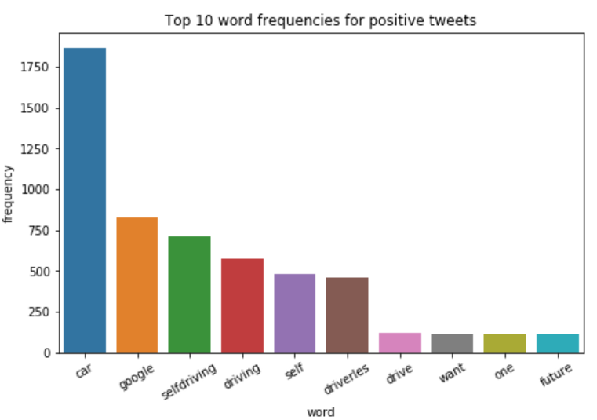
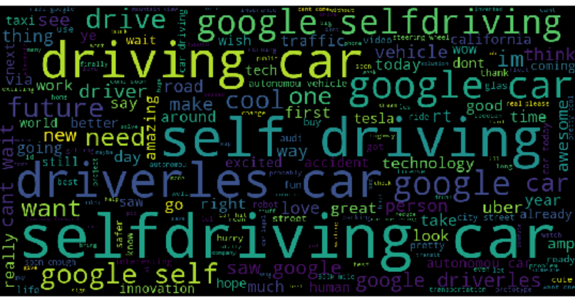
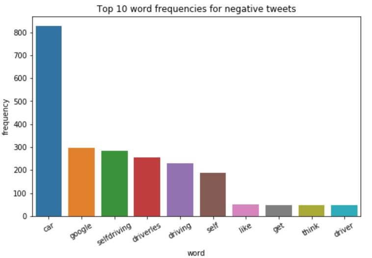
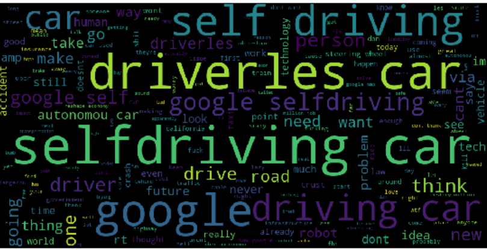
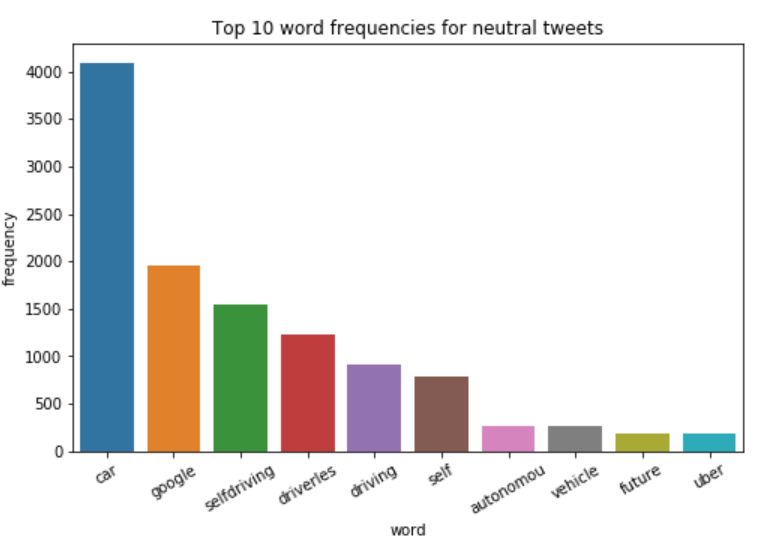
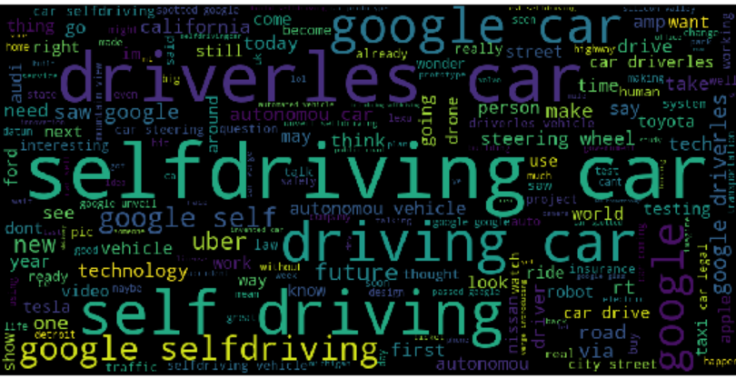

# DATA 512- Final Project : Twitter Sentiment Analysis - Self-driving cars

#### “From 2020, you will become a complete backseat driver”  - the Guardian. 

## Motivation
Autonomous driving has created a wave in the society in the last decade. The public has displayed highly polarized feelings for and 
against the idea of bringing self-driving cars to road from the outset. This project is an attempt to understand and analyse the general vibe around self-driving 
as expressed on Twitter around end of May in 2015. This was around the time when news was flying about Google's self-driving test initiative - 
[Google to begin testing purpose-built self-driving cars on public roads](https://www.theguardian.com/technology/2015/may/15/google-testing-purpose-built-self-driving-cars-public-roads).
Also around the same time were articles about accidents being caused by self-driving cars - [Self-driving car accidents revealed in California](https://www.bbc.com/news/technology-32691887).

## Background
There is surprisingly very little prior work on this dataset. Of the ones that I found, most of them were doing sentiment analysis and prediction using machine learning methods [1]. I wish to take a slightly different approach for this project.

## Research Directions
- What is the general sentiment of people around self-driving cars?
- What promoted these opinions? 
- What are people talking about? Did the happennings around the world sway people in one direction or another? 
- Study of the type of words used to express positive and negative sentiment

## Approach 
**1. Qualitative**
The thick data approach or the qualitative approach is used to answer questions like what promoted certain opinions 
of self-driving cars in the public? The conclusions in this section are quite open ended and left to the discretion of the reader. 
It is important to note that the answers here are speculative in nature and do not satisfy conditions of statistical significance. 

**2. Quantitative**
Quantitative approach is used to answer questions around the distribution of sentiment and the study of the type of 
words used to express positive and negative sentiment. 

## Dataset 
The dataset files can be found [here](https://www.figure-eight.com/data-for-everyone/).
The raw data file contains 11 columns, but only 3 of the columns will be useful for this analysis. 

| Column | Description |
|--------|-------------|
| sentiment | sentiment score on a scale of 1 - 5 |
| sentiment:confidence | confidence level between 0 - 1 |
| text | body of the tweet |

#### Sentiment scoring: 
  5: very positive  
  4: slightly positive  
  3: neutral  
  2: slightly negative  
  1: very negative  

#### How was the data collected?  
Contributors read tweets and classified them as very positive, slightly positive, neutral, slightly negative, or very negative. They were also prompted to mark if the tweet was not relevant to self-driving cars.

#### Ethical considerations
The dataset does not contain personally identifiable data such as names or Twitter handle. The tweet itself is a part of the dataset, but even if one could possibly trace the tweets back to the individual, I assume there should be no issues since the tweets are publicly available for anyone on the web to see. 

#### Summary of results
Addressing the initial questions I set out to answer -  
What is the general sentiment of people around self-driving cars? **Neutral**  
What promoted these opinions? **Google's self-driving test launch and accidents in California (speculation)**  
What are people talking about? **Google**  

| Sentiment              | Top 10 words | Word Cloud |  
|--------------------|---------------|---------------|  
|Positive | | |  
|Negative  | | |
|Neutral   | | |

## Unknowns/Limitations
This dataset contains tweets from 2015. To the best of my knowledge, there is no such publicly available dataset for the subsequent 
years which could have led to trend analysis and how opinions have changed over time.  

Since there is no thorough description of the distribution of the dataset, it is unclear whether this is a completely 
random sample representative of the population or harbors some biases. It is also hard to evaluate existence of potential biases 
for the same reason. 

## License
1. This repository and its contents are distributed under an open MIT License
2. Data License:  The [dataset](https://www.figure-eight.com/data-for-everyone/) is free for any and everyone to download. 
It is licensed under a Creative Commons Attribution 4.0 International License. 

## References
[1] [Sentiment Analysis of Opinions about Self Driving Cars](http://www.scsug.org/wp-content/uploads/2016/11/Sentiment-Analysis-about-SelfDrivingCars_NKawitkar_SDeshpande_OSUMSBA.pdf)
